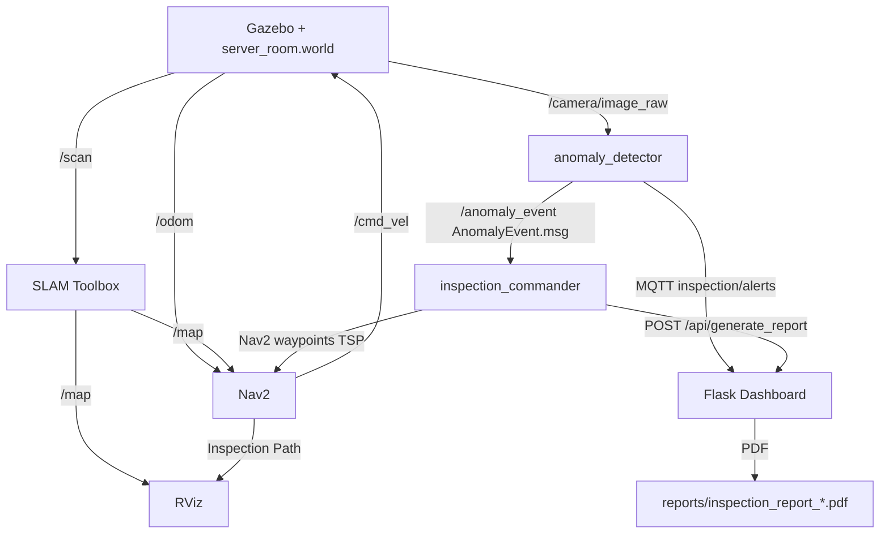
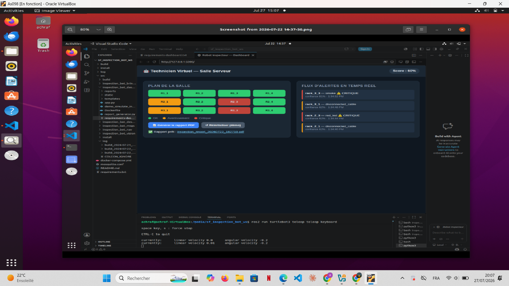

# 🤖 Autonomous Server Room Inspection Robot

<div align="center">


**An AI-powered autonomous mobile robot that patrols server rooms, detects anomalies using computer vision, and generates automated PDF inspection reports — all in real-time.**

🔗 [LinkedIn](https://www.linkedin.com/in/achraf-ismaili-alaoui-355b62368/) • 
🐙 [GitHub](https://github.com/achraf25-ctrl)

</div>

---

## 📌 Project Overview

This project implements a complete autonomous inspection system for server room environments. A **TurtleBot3** robot navigates autonomously through a simulated server room using **ROS 2 Nav2** and **SLAM Toolbox**, visits each rack following a **TSP-optimized route**, detects visual anomalies using **YOLOv8** (with an OpenCV fallback), and sends real-time alerts to a **Flask web dashboard** via **MQTT**.

Developed during an internship at the **Ministry of Economy and Finance of Morocco** (IT Infrastructure Division) as part of a Robotics & Connected Objects Engineering degree at **ENIAD, Berkane**.

---

## ✨ Features

- 🗺️ **Autonomous Navigation** — TurtleBot3 navigates a custom server room world using ROS 2 Nav2 stack
- 🧭 **Real-Time SLAM Mapping** — simultaneous localization and mapping with SLAM Toolbox
- 📐 **TSP-Optimized Inspection Route** — nearest-neighbor + 2-opt algorithm minimizes total travel distance across 12 racks
- 🔍 **Dual-Mode Anomaly Detection** — YOLOv8 (when model available) + pure OpenCV HSV fallback (always works)
- 🚨 **Priority Re-routing** — critical anomalies trigger immediate robot re-visit before continuing the patrol
- 📡 **Real-Time MQTT Alerts** — anomalies published to `inspection/alerts` topic and pushed to dashboard via Socket.IO
- 📊 **Web Dashboard** — live rack status grid (OK / Warning / Critical), alert feed, health score
- 📄 **Automated PDF Reports** — generated automatically at end of patrol via ReportLab
- 🐳 **Docker Compose Deployment** — one command starts MQTT broker + dashboard
- 🎮 **Demo Mode** — `demo_simulate_inspection.py` simulates a full inspection without ROS 2

---

## 🏗️ System Architecture

```
┌─────────────────────────────────────────────────────────────┐
│                    GAZEBO SIMULATION                        │
│   server_room.world │ TurtleBot3 waffle_pi                  │
│   RGB Camera (rgb_camera.xacro) │ Virtual LiDAR             │
└──────────────────────┬──────────────────────────────────────┘
                       │ /camera/image_raw  /scan  /odom
                       ▼
┌─────────────────────────────────────────────────────────────┐
│                    ROS 2 NODES                              │
│                                                             │
│  inspection_commander ──TSP──► Nav2 ──► /cmd_vel           │
│         │ /anomaly_event                                    │
│         ▼                                                   │
│  anomaly_detector ◄── /camera/image_raw                    │
│  (YOLOv8 + OpenCV HSV)                                     │
│         │                                                   │
│  SLAM Toolbox ──► /map ──► RViz Visualization              │
└──────────────────────┬──────────────────────────────────────┘
                       │ MQTT  inspection/alerts
                       ▼
┌─────────────────────────────────────────────────────────────┐
│              MOSQUITTO MQTT BROKER (port 1883)              │
└──────────────────────┬──────────────────────────────────────┘
                       │ Socket.IO
                       ▼
┌─────────────────────────────────────────────────────────────┐
│              FLASK WEB DASHBOARD (port 5000)                │
│   Rack Grid │ Alert Feed │ Health Score │ PDF Reports       │
└─────────────────────────────────────────────────────────────┘
```

### ROS 2 Node Graph



---

## 🗺️ RViz Navigation & SLAM Visualization

### Live Inspection Running in RViz


The screenshot above shows the **complete system running live**:

| Element | Description |
|---|---|
| **SLAM Map** | Server room layout fully built by SLAM Toolbox in real-time |
| **TurtleBot3** | Robot position visible on the map (green robot icon) |
| **TSP Inspection Path** | Optimized waypoint route shown in green — 11 numbered stops |
| **Navigation Arrows** | Nav2 planned trajectory toward next inspection point |
| **ROS 2 Logs** | Real-time node activity (anomaly detection, navigation feedback) |
| **Camera Detection** | Vision node active and processing frames |
| **RViz Displays** | Map ✅ — Inspection Path ✅ — TurtleBot3 Model ✅ — Camera View ✅ |

> This is **not a mockup** — this is ROS 2 running live inside Ubuntu on VirtualBox, built from scratch during a 4-week internship at the Ministry of Economy and Finance of Morocco.

---

## 📊 Web Dashboard

### Real-Time Monitoring Interface



| Feature | Description |
|---|---|
| **Rack Grid (3×4)** | Color-coded rack map — Green (OK) / Orange (Warning) / Red (Critical) |
| **Real-Time Alert Feed** | Live anomaly stream with rack ID, type, confidence, timestamp |
| **Health Score** | Global score: 100% − (5 × warnings) − (15 × criticals) |
| **Generate Report** | One-click PDF generation button |
| **Reset Demo** | Resets all racks to OK and clears history |

---

## 🛠️ Technology Stack

| Layer | Technology | Version | Purpose |
|---|---|---|---|
| Simulation | Gazebo | Classic | 3D physics simulation |
| Robot | TurtleBot3 waffle_pi | — | Mobile robot with RGB camera + LiDAR |
| Framework | ROS 2 | Humble | Robot middleware |
| Navigation | Nav2 | Humble | Autonomous path planning + obstacle avoidance |
| Mapping | SLAM Toolbox | Humble | Online async SLAM |
| Visualization | RViz 2 | Humble | Live map + path + robot display |
| Route Planning | TSP (nearest-neighbor + 2-opt) | custom | Optimal rack visit order |
| AI Detection | YOLOv8 (Ultralytics) | 8.x | Anomaly detection (optional) |
| Vision Fallback | OpenCV HSV thresholding | 4.10 | Red LED + open rack detection |
| Messaging | Paho MQTT + Mosquitto | 1.6 / 2.x | Real-time alert communication |
| Backend | Flask + Flask-SocketIO | 3.0 / 5.3 | Web server + real-time push |
| Reports | ReportLab | 4.2 | Automated PDF generation |
| Container | Docker + Docker Compose | 3.8 | One-command deployment |
| OS | Ubuntu | 22.04 | Operating system |

---

## 📁 Project Structure

```
inspection_bot_ws/
├── src/
│   ├── inspection_bot_bringup/          # ROS 2 launch files
│   │   └── launch/
│   │       └── bringup.launch.py        # Launches Gazebo + SLAM + Nav2
│   │
│   ├── inspection_bot_description/      # Robot and world description
│   │   ├── urdf/
│   │   │   └── rgb_camera.xacro         # RGB camera URDF definition
│   │   └── worlds/
│   │       └── server_room.world        # Custom Gazebo server room world
│   │
│   ├── inspection_bot_msgs/             # Custom ROS 2 messages
│   │   └── msg/
│   │       └── AnomalyEvent.msg         # anomaly_type, rack_id, confidence, critical, image_path
│   │
│   ├── inspection_bot_nav/              # Navigation + inspection logic
│   │   ├── config/
│   │   │   ├── inspection_points.yaml   # 12 rack positions (x, y, yaw_deg)
│   │   │   ├── nav2_params.yaml         # Nav2 configuration
│   │   │   └── slam_toolbox_params.yaml # SLAM Toolbox configuration
│   │   └── inspection_bot_nav/
│   │       ├── inspection_commander.py  # Main orchestrator: TSP + Nav2 + report trigger
│   │       └── tsp_planner.py           # TSP: nearest-neighbor + 2-opt optimizer
│   │
│   ├── inspection_bot_vision/           # Computer vision layer
│   │   ├── models/                      # YOLOv8 .pt model files (place here)
│   │   └── inspection_bot_vision/
│   │       ├── anomaly_detector.py      # ROS 2 node: /camera/image_raw → /anomaly_event
│   │       └── detectors.py             # YOLOv8 + OpenCV HSV detection logic
│   │
│   └── inspection_bot_dashboard/        # Flask web application
│       ├── app.py                       # Main Flask app + MQTT listener + Socket.IO
│       ├── report_generator.py          # PDF report generation (ReportLab)
│       ├── demo_simulate_inspection.py  # Standalone demo (no ROS 2 needed)
│       ├── requirements-dashboard.txt   # Dashboard Python dependencies
│       ├── Dockerfile                   # Dashboard container definition
│       ├── templates/
│       │   └── index.html               # Dashboard HTML page
│       ├── static/
│       │   ├── style.css                # Dashboard styles
│       │   └── dashboard.js             # Socket.IO real-time updates
│       └── reports/                     # Generated PDF reports saved here
│
├── docker-compose.yml                   # Mosquitto + Dashboard services
├── mosquitto.conf                       # MQTT broker config (ports 1883 + 9001)
├── requirements.txt                     # Full Python dependencies
└── screenshots/
    ├── rviz_slam_navigation.png         # RViz live navigation screenshot
    └── dashboard.png                    # Flask dashboard screenshot
```

---

## ⚙️ Installation

### Prerequisites

- Ubuntu 22.04 LTS
- ROS 2 Humble — [Installation guide](https://docs.ros.org/en/humble/Installation.html)
- Docker + Docker Compose
- Python 3.10+

### Step 1 — Clone the repository

```bash
git clone https://github.com/achraf25-ctrl/autonomous-server-room-inspection-robot.git
cd autonomous-server-room-inspection-robot
```

### Step 2 — Install ROS 2 dependencies

```bash
sudo apt update
sudo apt install -y \
  ros-humble-turtlebot3 \
  ros-humble-turtlebot3-gazebo \
  ros-humble-navigation2 \
  ros-humble-nav2-bringup \
  ros-humble-slam-toolbox \
  ros-humble-cv-bridge \
  ros-humble-rviz2 \
  python3-colcon-common-extensions

pip install -r requirements.txt
```

### Step 3 — Install Python dependencies

```bash
pip install -r requirements.txt
# Dashboard only:
pip install -r src/inspection_bot_dashboard/requirements-dashboard.txt
```

### Step 4 — (Optional) Install YOLOv8

```bash
pip install ultralytics==8.2.0
# Place your trained .pt model in:
# src/inspection_bot_vision/models/
```

### Step 5 — Build the ROS 2 workspace

```bash
colcon build --symlink-install
source install/setup.bash
```

---

## 🚀 Running the Project

### Environment Setup (run in every terminal)

```bash
source /opt/ros/humble/setup.bash
source install/setup.bash
export TURTLEBOT3_MODEL=waffle_pi
```

---

### Terminal 1 — Start MQTT Broker + Dashboard

```bash
docker-compose up
```

✅ Dashboard available at: **http://localhost:5000**

---

### Terminal 2 — Launch Gazebo + SLAM + Nav2

```bash
ros2 launch inspection_bot_bringup bringup.launch.py
```

This launches simultaneously:
- Gazebo with `server_room.world` and TurtleBot3 waffle_pi
- SLAM Toolbox (online async SLAM)
- Nav2 navigation stack (with `nav2_params.yaml`)

---

### Terminal 3 — Open RViz (SLAM Map Visualization)

```bash
rviz2
```

In RViz, add these displays:
- **Map** → topic `/map`
- **LaserScan** → topic `/scan`
- **Robot Model** → `robot_description`
- **Path** → topic `/plan`

You will see the server room map building in real-time and the TSP inspection route displayed as a green path with numbered waypoints.

---

### Terminal 4 — Launch Anomaly Detector

```bash
ros2 run inspection_bot_vision anomaly_detector
```

Subscribes to `/camera/image_raw`, runs detection, publishes to:
- `/anomaly_event` (ROS 2 topic — custom `AnomalyEvent.msg`)
- `inspection/alerts` (MQTT topic → Dashboard)

---

### Terminal 5 — Launch Inspection Commander

```bash
ros2 run inspection_bot_nav inspection_commander
```

This is the main orchestrator. It:
1. Loads 12 rack positions from `inspection_points.yaml`
2. Computes the optimal TSP route (nearest-neighbor + 2-opt)
3. Sends waypoints to Nav2 one by one
4. Handles critical anomaly re-routing
5. Triggers PDF report generation at end of patrol

---

### Demo Mode (No ROS 2 Required)

Test the dashboard and PDF generation without any ROS 2:

```bash
# Terminal 1 — Start dashboard
docker-compose up
# OR without Docker:
cd src/inspection_bot_dashboard
python3 app.py

# Terminal 2 — Simulate inspection
cd src/inspection_bot_dashboard
python3 demo_simulate_inspection.py
```

---

## 🔍 Anomaly Detection Pipeline

```
/camera/image_raw (sensor_msgs/Image)
             │
             ▼
      cv_bridge → OpenCV BGR frame
             │
             ├─► YOLOv8 Inference (if .pt model present in models/)
             │     └─► Classes: red_led │ disconnected_cable
             │                  open_rack_door │ smoke
             │
             └─► OpenCV HSV Fallback (always active)
                   ├─► Red LED: HSV hue 0°–8° and 172°–180°
                   └─► Open rack: large dark rectangle heuristic
             │
             ▼
    Detection(anomaly_type, confidence, bbox, critical=True/False)
             │
             ├─► Save snapshot → ~/inspection_bot_snapshots/
             ├─► Publish /anomaly_event (AnomalyEvent.msg)
             └─► Publish MQTT "inspection/alerts" → Dashboard
```

### Anomaly Types

| Type | Critical | Detection |
|---|---|---|
| `red_led` | No | OpenCV HSV thresholding |
| `open_rack_door` | No | Dark rectangle heuristic |
| `disconnected_cable` | No | YOLOv8 |
| `smoke` | **Yes → re-route** | YOLOv8 |

---

## 📐 TSP Route Planning

Implemented in `tsp_planner.py`:

1. **Nearest-neighbor heuristic** — greedy initial tour from robot start pose
2. **2-opt local search** — iterative edge swap until no improvement found

**12 inspection points** defined in `inspection_points.yaml`:

| Row | Racks | Y position |
|---|---|---|
| Row 1 | rack_1_1 → rack_1_4 | y = 1.8 m |
| Row 2 | rack_2_1 → rack_2_4 | y = −0.7 m |
| Row 3 | rack_3_1 → rack_3_4 | y = −3.2 m |

Robot start pose: `x=0.0, y=−3.8, yaw=90°`

---

## 📄 Automated PDF Reports

Generated by `report_generator.py` using **ReportLab**.

Each report contains:
- Inspection timestamp and duration
- Global health score (0–100%)
- Complete anomaly log with rack ID, type, confidence, timestamp
- Rack-by-rack status summary
- Recommended maintenance actions

Saved as: `reports/inspection_report_YYYYMMDD_HHMMSS.pdf`

---

## 🌐 Flask API Endpoints

| Endpoint | Method | Description |
|---|---|---|
| `/` | GET | Dashboard HTML page |
| `/api/racks` | GET | Current status of all 12 racks |
| `/api/alerts` | GET | Last 50 alerts |
| `/api/health_score` | GET | Current health score |
| `/api/generate_report` | POST | Generate PDF report |
| `/api/simulate_alert` | POST | Inject test alert (demo) |
| `/api/reset_demo` | POST | Reset all racks to OK |
| `/reports/<filename>` | GET | Download generated PDF |

---

## 📈 Results

| Metric | Value |
|---|---|
| Inspection points | 12 racks (3 rows × 4 columns) |
| TSP route optimization | nearest-neighbor + 2-opt |
| SLAM map quality | Full server room mapped in real-time |
| MQTT alert latency | < 100 ms |
| PDF generation time | < 2 seconds |
| Dashboard update | Real-time via Socket.IO |
| Dwell time per rack | 4 seconds |
| Detection cooldown | 15 seconds per rack |

---

## 🔮 Future Improvements

- [ ] Train custom YOLOv8 model on real server room dataset (MVTec AD)
- [ ] Deploy on physical TurtleBot3 hardware (Sim-to-Real transfer)
- [ ] Multi-robot coordination for parallel zone inspection
- [ ] 3D mapping with RTAB-Map
- [ ] Email / SMS alert integration
- [ ] Historical trend analysis dashboard
- [ ] Integration with DCIM systems
- [ ] ROS 2 Action Server for inspection missions


---

## 👤 Author

**Achraf Ismaili Alaoui**
Robotics & Connected Objects Engineering Student
ENIAD — École Nationale de l'Intelligence Artificielle et du Digital, Berkane, Morocco
Internship: Ministry of Economy and Finance of Morocco — IT Infrastructure Division

🔗 [LinkedIn](https://www.linkedin.com/in/achraf-ismaili-alaoui-355b62368/) | 🐙 [GitHub](https://github.com/achraf25-ctrl)

---

## 🙏 Acknowledgments

Special thanks to **Mme Nabaouia Louiridi**, internship supervisor at the Ministry of Economy and Finance of Morocco, for her invaluable guidance, trust, and support throughout this project.

- ROS 2 Community & Nav2 Contributors
- SLAM Toolbox Team
- Ultralytics YOLOv8 Team
- TurtleBot3 Open Source Community (ROBOTIS)
- ENIAD — Robotics & Connected Objects Engineering Program
